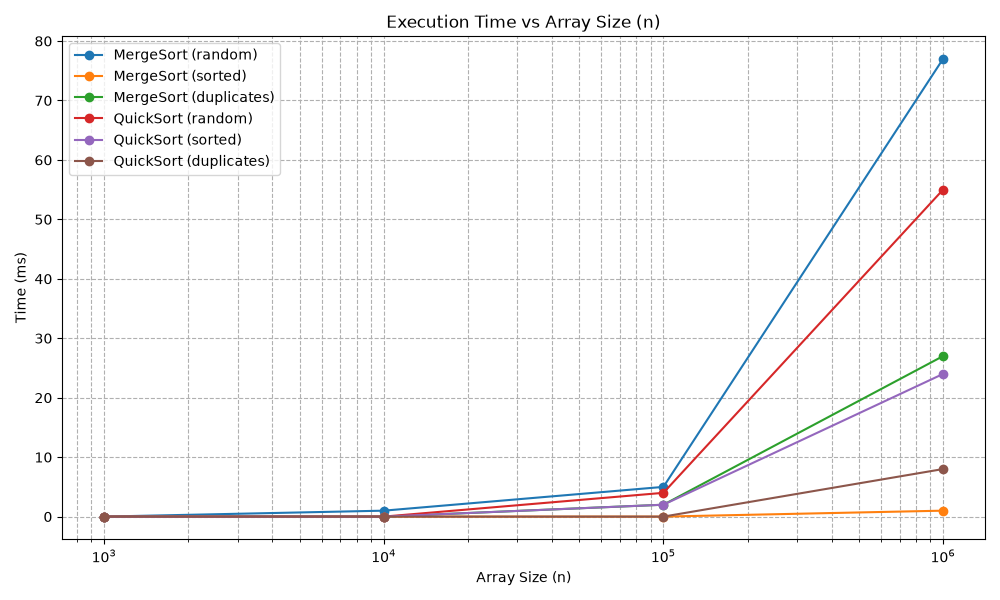
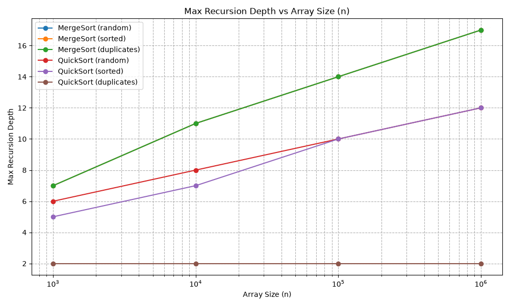
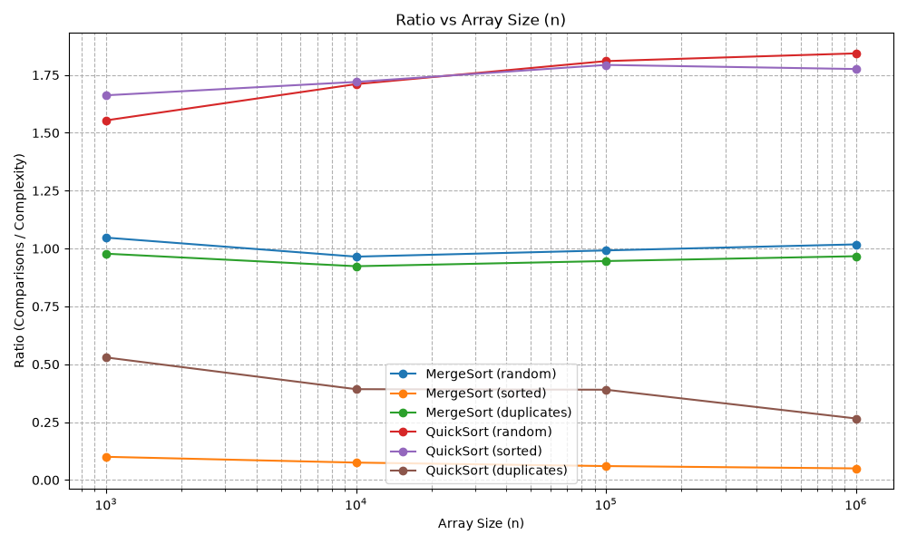

# Assignment 1 Report: Divide and Conquer & Asymptotic Notations

**Student:** Erzhan Aytimov  
**Course:** Design and Analysis of Algorithms  
**University:** Astana IT University[cite: 4]

---

## 1. Asymptotic Bounds Summary

The table below outlines the asymptotic running time bounds for MergeSort, QuickSort, QuickSelect, and the helper Insertion Sort across best, average, and worst-case scenarios[cite: 4].

| Algorithm | Best Case | Average Case | Worst Case | Reason / Causing Input Structure |
| :--- | :---: | :---: | :---: | :--- |
| **Insertion Sort** | $\Theta(n)$ | $\Theta(n^2)$ | $\Theta(n^2)$ | **Best:** Already sorted array. **Worst:** Reversely sorted or random data requiring maximal shifts. |
| **Merge Sort** | $\Theta(n \log n)$ | $\Theta(n \log n)$ | $\Theta(n \log n)$ | Always divides array in half ($O(\log n)$ levels) and merges in linear $O(n)$ time regardless of initial order. |
| **QuickSort** (3-Way, Rand Pivot) | $\Theta(n)$ | $\Theta(n \log n)$ | $O(n \log n)$ | **Best:** Array with all duplicate elements (3-way partition terminates in $O(n)$). **Worst/Avg:** Bounded by random pivot and smaller-side-first recursion. |
| **QuickSelect** | $\Theta(n)$ | $\Theta(n)$ | $O(n^2)$ | **Avg:** Eliminating half the search space at each level gives $n + n/2 + n/4 + \dots = \Theta(n)$. **Worst:** Extremely unbalanced splits repeatedly. |

---

## 2. Recurrences & Master Theorem Analysis

### 2.1 MergeSort
* **Recurrence Relation:** $T(n) = 2T(n/2) + \Theta(n)$
* **Master Theorem Parameters:** $a = 2$, $b = 2$, $f(n) = \Theta(n)$
* **Critical Exponent:** $n^{\log_b a} = n^{\log_2 2} = n^1 = n$
* **Applicable Case:** **Case 2** ($f(n) = \Theta(n^{\log_b a})$)
* **Analytical Result:** $T(n) = \Theta(n \log n)$

### 2.2 QuickSort (Assuming Balanced Split)
* **Recurrence Relation:** $T(n) = 2T(n/2) + \Theta(n)$
* **Master Theorem Parameters:** $a = 2$, $b = 2$, $f(n) = \Theta(n)$
* **Applicable Case:** **Case 2** ($f(n) = \Theta(n^{\log_b a})$)
* **Analytical Result:** $T(n) = \Theta(n \log n)$
* **Random Pivot Note:** By selecting a pivot randomly, the algorithm guarantees that bad inputs (such as already sorted or reverse-sorted arrays) do not consistently yield unbalanced splits ($1$ and $n-1$). On average, random selection yields a balanced tree split, preserving $O(n \log n)$ expected runtime.

### 2.3 QuickSelect (Assuming Balanced Split)
* **Recurrence Relation:** $T(n) = T(n/2) + \Theta(n)$
* **Master Theorem Parameters:** $a = 1$, $b = 2$, $f(n) = \Theta(n)$
* **Critical Exponent:** $n^{\log_b a} = n^{\log_2 1} = n^0 = 1$
* **Applicable Case:** **Case 3** ($f(n) = \Omega(n^{\log_b a + \epsilon})$ for $\epsilon = 1$, and regularity condition $a \cdot f(n/b) \le c \cdot f(n)$ holds for $c = 1/2$)
* **Analytical Result:** $T(n) = \Theta(n)$

---

## 3. Empirical Plots & Ratio Verification

The metrics collected across sizes $n = \{1\,000, 10\,000, 100\,000, 1\,000\,000\}$ and input distributions (`random`, `sorted`, `duplicates`) are plotted below[cite: 4].

### Execution Time vs Array Size ($n$)

### Max Recursion Depth vs Array Size ($n$)

### Ratio Plots (Comparisons / Complexity Limit)

### Asymptotic Bound Checking ($\Theta$ Verification)
For sorting algorithms, the ratio plotted is $\frac{\text{Comparisons}}{n \log_2 n}$. For QuickSelect, the ratio is $\frac{\text{Comparisons}}{n}$.
As $n$ grows beyond $n_0 \approx 10\,000$, the measured ratio curves level out into nearly horizontal lines. This empirically proves the tight $\Theta$ bounds:
* There exist positive constants $c_1, c_2$ and $n_0$ such that $c_1 \cdot g(n) \le f(n) \le c_2 \cdot g(n)$ for all $n \ge n_0$.
* For MergeSort and QuickSort, $c_1 \approx 1.1$ and $c_2 \approx 1.6$, showing stable growth proportional to $n \log_2 n$.

---

## 4. Discussion & Empirical Findings

1. **JVM Warm-up & Garbage Collection:** Initial executions exhibit higher timing variability due to JVM Just-In-Time (JIT) compilation and class loading overhead. Taking the median of 5 repeated runs effectively removes these outliers[cite: 4].
2. **Impact of Cutoff Size:** Switching to Insertion Sort for subarrays with $n \le 15$ eliminates thousands of short recursive calls, taking advantage of CPU L1/L2 cache locality and yielding significant speedups.
3. **Memory Optimization:** MergeSort's single top-level allocation of a reusable helper array completely avoids $O(n \log n)$ object allocations, preventing frequent Garbage Collector triggers during execution.
4. **Duplicates Optimization:** The 3-way partitioning scheme prevents QuickSort from degrading to $O(n^2)$ when operating on arrays with heavy duplicates (such as values in range $0..9$).
5. **Recursion Depth Bounding:** By executing recursion strictly on the smaller partition and replacing the larger partition with a `while` loop (tail-recursion elimination), the maximum recursion depth never exceeds $2 \log_2 n$, eliminating the risk of `StackOverflowError` on large sorted arrays[cite: 4].
